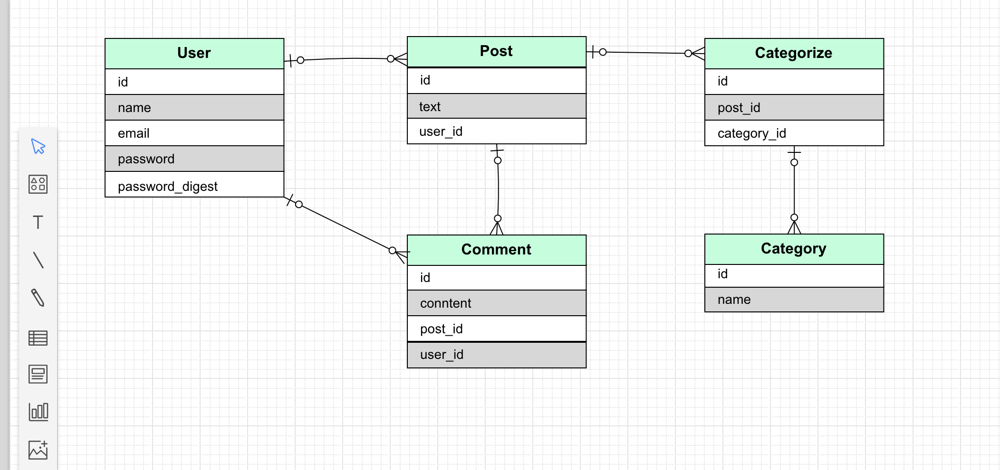
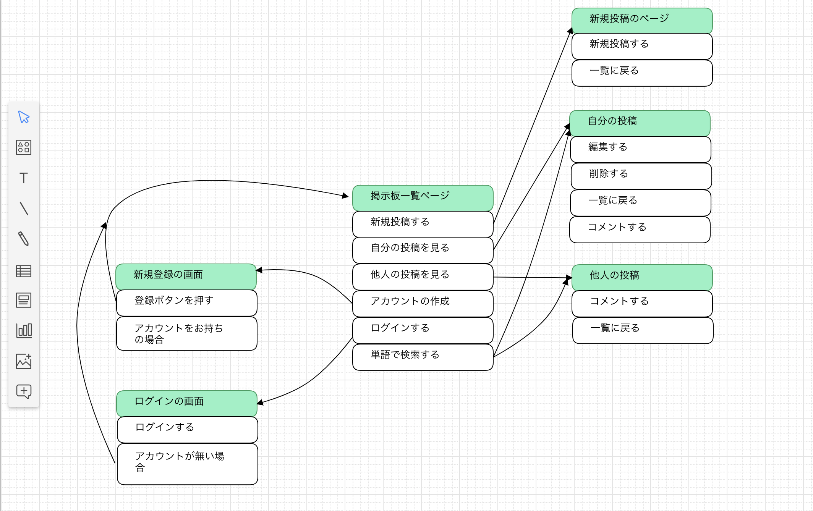
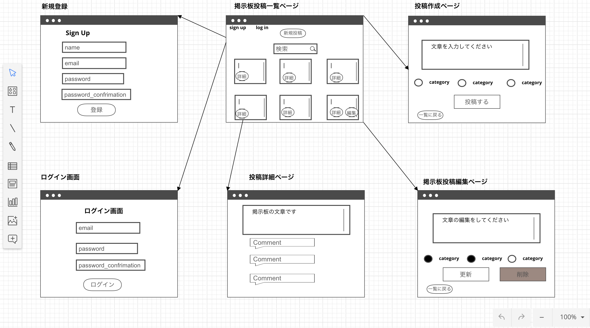

# README

# 技術テスト用掲示板アプリ

# 概要
* ユーザが掲示板に文章の投稿ができ、さらに文章にはカテゴリーを複数付与できる。
* ユーザーは単語や文章で投稿を検索することができる

# バージョン情報
* Ruby 2.6.3
* Rails 5.2.4.1

# 機能一覧
- [ ] ユーザー登録機能
- [ ] ログイン機能
- [ ] 文章の投稿機能
- [ ] 投稿に対するコメント機能
- [ ] 検索機能
- [ ] カテゴライズ機能

# カタログ設計
https://docs.google.com/spreadsheets/d/1Mhn36VhOUSuRNjvGwkQTS-shFwmxaivPIRheb6S8hKE/edit#gid=0
# テーブル設計
https://docs.google.com/spreadsheets/d/1Mhn36VhOUSuRNjvGwkQTS-shFwmxaivPIRheb6S8hKE/edit#gid=1462770733
# ER図
https://docs.google.com/spreadsheets/d/1Mhn36VhOUSuRNjvGwkQTS-shFwmxaivPIRheb6S8hKE/edit#gid=168156034

# 画面遷移図
https://docs.google.com/spreadsheets/d/1Mhn36VhOUSuRNjvGwkQTS-shFwmxaivPIRheb6S8hKE/edit#gid=1330771236

# ワイヤーフレーム
https://docs.google.com/spreadsheets/d/1Mhn36VhOUSuRNjvGwkQTS-shFwmxaivPIRheb6S8hKE/edit#gid=828425960

# 使用gem一覧
## 辞書機能
* rails-i18n
## ログイン機能
* devise
## アドミン機能
* rails_admin
* cancancan
## 検索機能
* ransack
## デバッグ
* pry-rails
* better_errors
## テスト
* rspec-rails
* spring-commands-rspec
* factory_bot_rails
* faker
* launchy
* capybara
* webdrivers

# セットアップ
* 1 git clone git@github.com:yujiharinezumi/Polybility.git
* 2 bundle install
* 3 rails db:create db:migrate
* 4 rails db:seed
* 5 rails s

# アプリ製作予定
+ 2/13 要件定義完成
* 2/14-16 バックエンド実装完成,検索、カテゴリー機能は時間がかかってもよい
* 2/17  heroku でデプロイ,Rspecでテストを完成
* 2/18 -19 デザインを整える(余裕があればメディアクエリでレスポンシブ化)
* 2/20 リファクタリング、インデント整え、仕上げ
